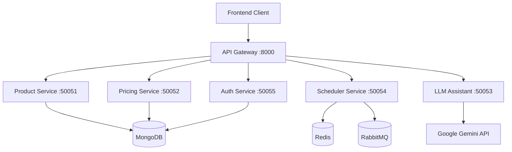

# OmniPriceX: Microservices Architecture

## Architecture Overview

OmniPriceX is a microservices-based pricing intelligence platform that implements modern distributed system patterns for scalability, reliability, and maintainability.

## System Design Patterns

### 1. Domain-Driven Design
```
├── Product Catalog     → Product management & inventory
├── Pricing Engine      → Dynamic pricing & competitor analysis  
├── User Management     → Authentication & authorization
├── AI Assistant        → LLM-powered insights & recommendations
├── Task Scheduling     → Background job processing
└── API Gateway         → Request routing & composition
```

### 2. Observability
- Distributed tracing for request correlation
- Metrics collection for performance monitoring
- Structured logging for debugging and analysis
- Health checks for service monitoring

### 3. API Design
- OpenAPI 3.0 specifications
- RESTful endpoints with proper HTTP semantics
- Input validation with detailed error responses
- Consistent response formats across services

### 4. Service Communication
- gRPC for internal service-to-service communication
- REST APIs for client-facing endpoints
- Message queues for asynchronous processing
- Service discovery via DNS

### 5. Security
- JWT-based authentication
- Request validation and sanitization
- Role-based access control
- CORS configuration

## Technical Features

### Scalability
- Containerized services with Docker
- Horizontal scaling capabilities
- Database per service pattern
- Caching with Redis

### Reliability
- Health check endpoints
- Connection pooling
- Error handling with proper HTTP status codes
- Service isolation

### Monitoring
- Prometheus metrics integration
- Structured JSON logging
- Performance tracking
- Error rate monitoring

### Development
- Infrastructure as Code with Terraform
- Docker Compose for local development
- Environment-specific configurations
- API documentation generation

## Service Architecture



## Technology Stack

### Backend Services
- Python 3.11+ with type hints
- FastAPI for async web framework
- gRPC with Protocol Buffers
- Pydantic for data validation
- Motor for async MongoDB operations

### Infrastructure
- MongoDB for document storage
- Redis for caching and sessions
- RabbitMQ for message queuing
- Docker for containerization
- Terraform for infrastructure management

### AI/ML Integration
- Google Gemini API
- Pandas for data processing
- Async task processing

## Code Quality Standards

### Architecture Principles
- SOLID principles for maintainable code
- Separation of concerns
- API-first design approach
- Comprehensive error handling

### Testing
- Unit tests for individual services
- Integration tests for service interactions
- API contract validation
- Health check testing

### Security
- Input validation on all endpoints
- JWT authentication with expiration
- Role-based access control
- CORS configuration for web clients

## Performance Considerations

### Scalability
- Asynchronous request processing
- Database connection pooling
- Caching strategies
- Service isolation

### Monitoring
- Response time tracking
- Error rate monitoring  
- Resource utilization metrics
- Health status reporting

### Development Experience
- Auto-generated API documentation
- Type safety with Python type hints
- Hot reload for development
- Structured configuration management
