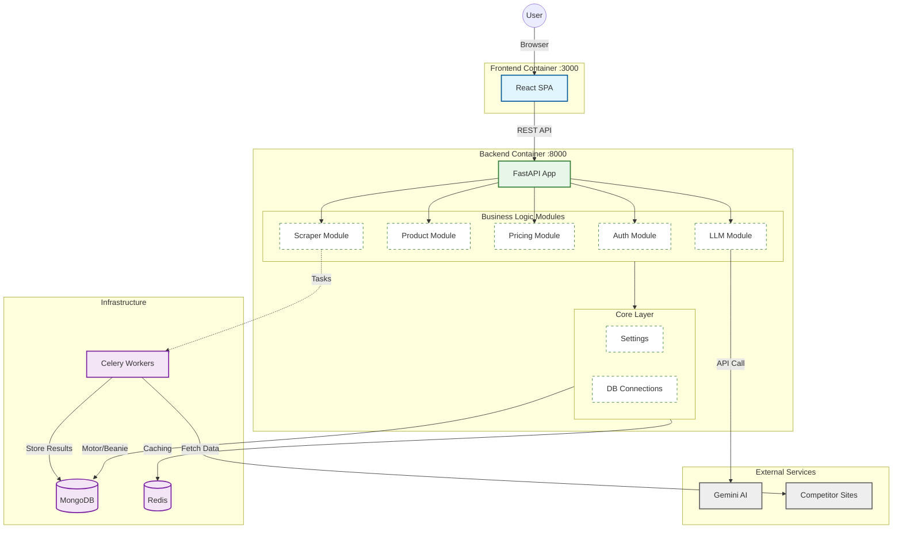

# OmniPrice System Architecture

Based on the codebase analysis (specifically `omniprice/main.py` and `infra/docker/docker-compose.yml`), OmniPrice is architected as a **Modular Monolith**.

## System Design Diagram

## Component Breakdown

### 1. Frontend (Port 3000)
- **Tech**: React
- **Role**: Single Page Application (SPA) for the dashboard.
- **Communication**: Consumes the REST API exposed by the backend.

### 2. Backend Monolith (Port 8000)
- **Tech**: Python, FastAPI, Uvicorn.
- **Role**: Hosts all business logic in a single process.
- **Structure**:
    - **API Layer**: `api/v1/` handles routing and request validation.
    - **Modules**: `modules/` contains domain logic (Product, Pricing, etc.).
    - **Core**: `core/` handles shared concerns like DB connections and Settings.

### 3. Infrastructure
- **MongoDB**: Primary database. Accessed asynchronously via `motor`.
- **Redis**: Used for caching pricing data and as a message broker for Celery.
- **Celery**: Handles background tasks (e.g., scraping competitor prices) to keep the API responsive.

## Data Flow Example: "Get Optimized Price"
1. **User** requests price on Dashboard.
2. **FastAPI** receives `GET /api/v1/pricing/{id}`.
3. **Pricing Module** is called directly (function call).
4. **Pricing Module** checks **Redis** cache.
5. If miss, queries **MongoDB** via `core.database`.
6. Returns data to Frontend.
